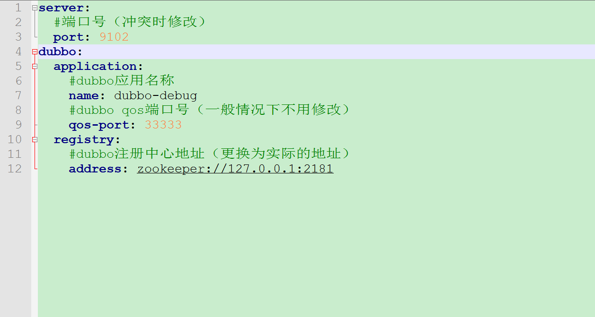

# dubbo-debug
## dubbo接口调试工具
### 一、功能
   使用http请求的方式调用dubbo接口（泛化调用），可用于dubbo接口调试。
### 二、使用（项目模式）
#### 默认请求地址为：127.0.0.1:9102/dubbo/debug
#### 1.克隆或下载到本地（JDK为1.8+版本）
按需修改application.yml配置，端口号有冲突时修改，注册中心地址修改为实际的地址

#### 2.切换到项目中
##### 2.1 运行命令mvn clean package进行打包
##### 2.2 打包完成之后再运行命令mvn spring-boot:run启动项目
##### 2.3 http请求格式（参考例子）
```java
{
    "service": "com.example.api.UserService",
    "method": "queryUser",
    "types": [
        "com.example.param.RequestParam"
    ],
    "args": [
        {
            "name": "admin"
        }
    ]
}
```
### 三、使用（安装包模式）
#### 默认请求地址为：127.0.0.1:9102/dubbo/debug
#### 下载dubbo-debug-setup.exe并安装后在文件夹里点击dubbo-debug.exe运行即可
####  [下载链接](https://github.com/hkbaicfl/dubbo-debug/releases)
